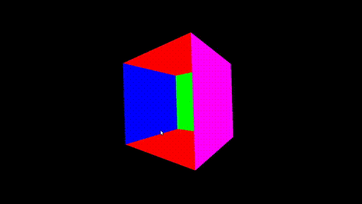
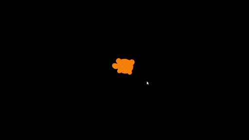
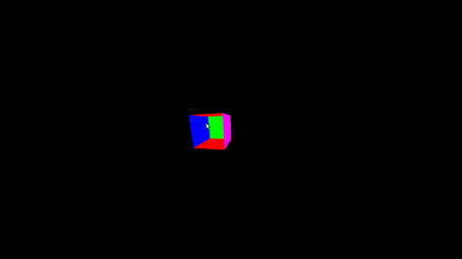
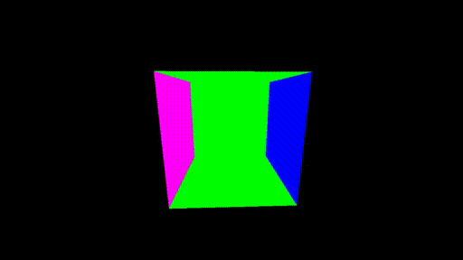
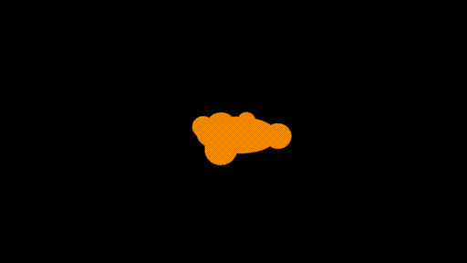
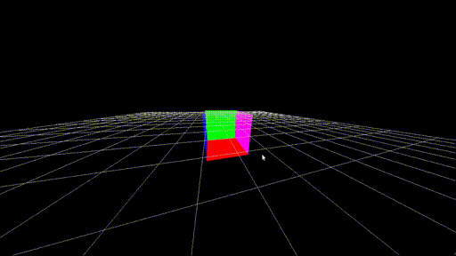
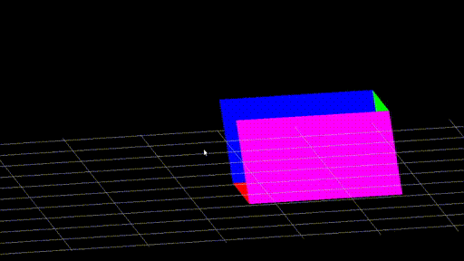
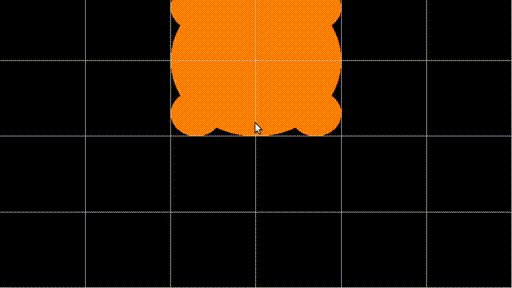

# Repositorio de Computación Grafica Cs 2019
Fase II 

Viendo la escena desde otro punto de vista: CÁMARAS
- Mover la cámara con el mouse
- Cambios de perspectiva de la cámara (ortogonal a perspectiva) 
- Mover el objeto en la proyección (con las teclas)

Requerimientos:
- OpenGL (ubuntu)
```
$ sudo apt-get update
$ sudo apt-get install libglu1-mesa-dev freeglut3-dev mesa-common-dev
```
# 1. Mover la cámara con el mouse
## Gráfica con el movimiento del mouse - (con el cubo)



## Gráfica dando click - (con el cubo)



```
GlutMouseFunc(mouse); //Pulsado de Botones
glutMotionFunc(NULL); //Movimiento con Botones pulsados
glutPassiveMotionFunc(MouseMotion); //Movimientos sin Botones pulsados
```

# 2. Mover el objeto en la proyección (con las teclas)
## Gráfica de proyección con teclas



# 3. Programa (con tecla) que permite cambiar el modo de proyección entre ORTOGONAL y PERSPECTIVA
## Gráfica Ortogonal



## Gráfica Perpectiva



# 4. Otros modos de movimiento de cámara como son el MODO PAN o el MODO TRÍPODE
## Gráfica Modo PAN
## Gráfica MODO TRÍPODE
